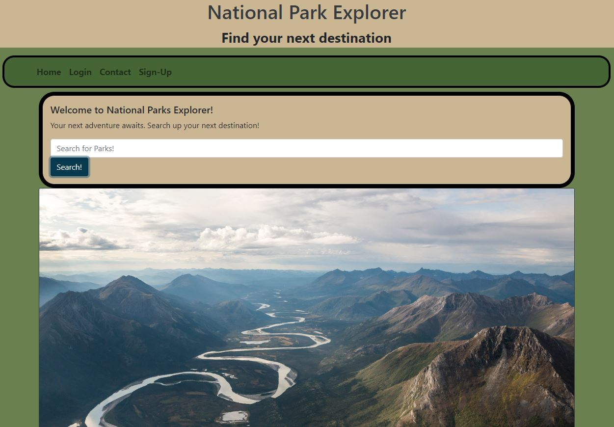

# National Park Explorer
   
  ## Table of Contents:
  [Description](#description) 
  [Usage](#usage) 
  [Technologies](#technologies) 
  [Team](#Team) 
  [FutureDevelopment](#Directions) 
  [Contributions](#contributions) 
  [Links](#Links) 
  [License](#license) 
  [Contact](#Contact) 

## Description

Looking for your next big adventure? Do you love touring around the country enjoying the great outdoors or finding a park near you? Then look no further! Our website, National Park Explorer, allows you to search for your next national park destination. It also allows you to view comments posted from other users to decide if that park is right for you. 
 

## Usage 
We wanted to cater to those looking for a national park to go to on their next adventure! Our website allows users to look up parks and comments associated with those parks to decide if it is the right trip for them. 
 

## Technologies
Technologies used include React.js, JavaScript, HTML, CSS, Bootstrap, data from the National Parks Service, GraphQL, Mongoose, MongoDB and is deployed with Heroku. 
  

## Team
Brady: Project Manager: backend functionality, apollo client on backend to view schemas, assisted with API pull logic on front end for park data.

Stuart: Worked on react/css, bootstrap implementation, UXUI design, debugging, team assistance, endpoints.

Eric: Worked on backend functionality/logic, setting up apollo client on backend to view schemas, API pull logic on front end for park data.

Elizabeth: Worked on front end react/css, created pages in client side of application, general layout / UXUI design, and wrote this readme. 
 

## Directions for Future Development

Directions for the future include creating a filter by location function to show the distance from the user's computer to the national park. Comments and ratings are currently being implemented, stay tuned! We would also like to add a share to social media option so other's could post their linked reviews to facebook, instagram, pinterest, etc. 
 

## Contributions

Contributions are not currently being accepted. If you would like to work on this project on your own, please reference the licensure and then fork the repository. 

## Links
Links to the deployed application and the GitHub repository.  
https://github.com/StuMartin22/national-park-explorer  
https://natl-parks-explorer.herokuapp.com/  

## License

  [The MIT license](https://opensource.org/licenses/MIT)
  
    Copyright 2022
    
    Permission is hereby granted, free of charge, to any person obtaining a copy of this software and associated documentation files (the "Software"), to deal in the Software without restriction, including without limitation the rights to use, copy, modify, merge, publish, distribute, sublicense, and/or sell copies of the Software, and to permit persons to whom the Software is furnished to do so, subject to the following conditions:
    
    The above copyright notice and this permission notice shall be included in all copies or substantial portions of the Software.
    
    THE SOFTWARE IS PROVIDED "AS IS", WITHOUT WARRANTY OF ANY KIND, EXPRESS OR IMPLIED, INCLUDING BUT NOT LIMITED TO THE WARRANTIES OF MERCHANTABILITY, FITNESS FOR A PARTICULAR PURPOSE AND NONINFRINGEMENT. IN NO EVENT SHALL THE AUTHORS OR COPYRIGHT HOLDERS BE LIABLE FOR ANY CLAIM, DAMAGES OR OTHER LIABILITY, WHETHER IN AN ACTION OF CONTRACT, TORT OR OTHERWISE, ARISING FROM, OUT OF OR IN CONNECTION WITH THE SOFTWARE OR THE USE OR OTHER DEALINGS IN THE SOFTWARE.

  ## Feel free to contact the team!
  
  ### GitHub Usernames: 
  [BMavetz](www.github.com/BMavetz)  
  [StuMartin22](www.github.com/StuMartin22)  
  [ekkjohnson](www.github.com/ekkjohnson)  
  [EricPhilipps](www.github.com/EricPhilipps)  
   

  ### Email Addresses: 
  stucodes22@gmail.com  
  ekkjohnson@gmail.com   
  b.mavetz@outlook.com  
  ericphilipps123@gmail.com  
   
  If you have any additional questions, you can send an email to the address provided above.